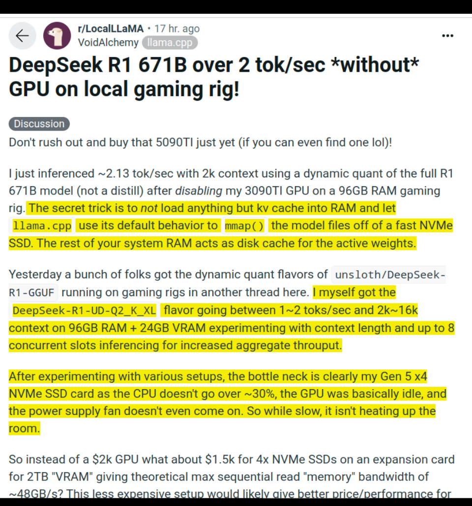
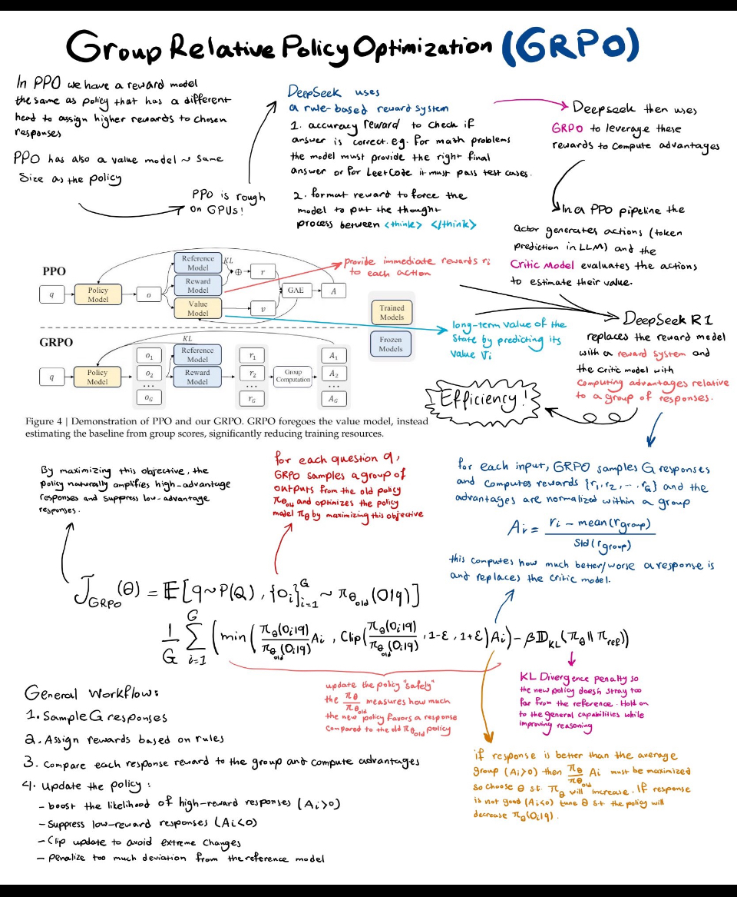
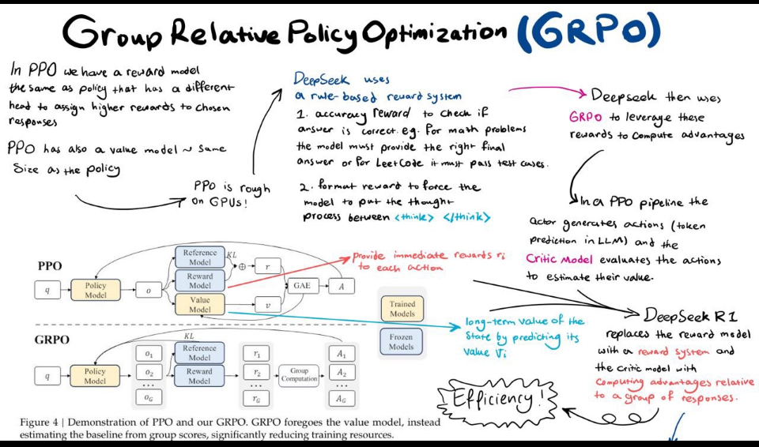
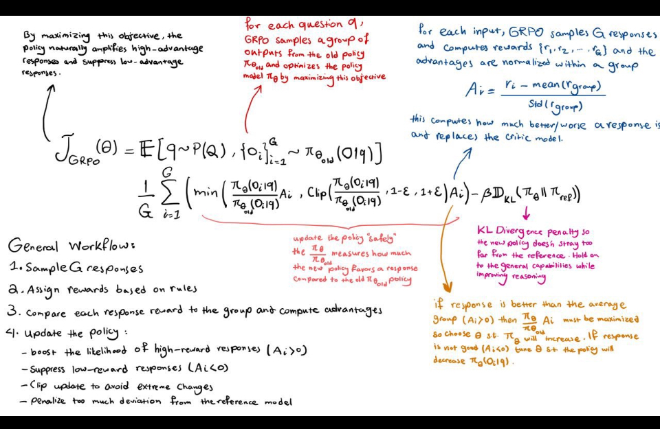
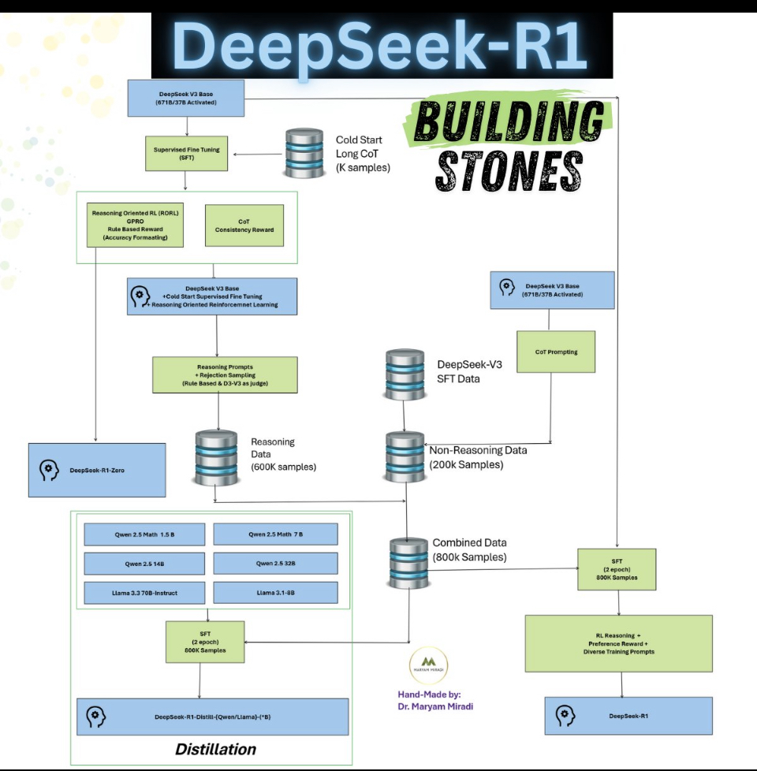

# DeepSeek 

* AI BT
* DeepSeek - zero
* DeepSeek - R1


# 📌 Note for GitHub Users

> This content is intended as a masterclass outline and script for business students exploring DeepSeek AI. If you're looking for a structured walkthrough of DeepSeek's business and technical impact — including hands-on demos, discussions, and group activities — you're in the right place.

---

# DeepSeek AI and the Global Race to Intelligence

**Instructor:** Ricardo A. Calix, Ph.D.

**Audience:** Business students interested in AI

**Duration:** 90 minutes

**Delivery Format:** Interactive + Hands-on

---

## Part 1: Introduction – The Global AI Landscape (15 min)

**Read-Aloud Script:**

"Welcome, everyone! Today we're diving into one of the most exciting and fast-moving developments in the AI world — the rise of *DeepSeek AI*, a powerful open-source model out of China that rivals the likes of OpenAI's GPT-4. Why does this matter? Because it's not just a technical marvel — it's a sign that AI is no longer confined to Silicon Valley."

"We’re now in a global race, and China’s AI ambitions are real. Governments are investing, startups are scaling, and entire economies are being shaped by how they harness artificial intelligence."

**Live Poll (Mentimeter/Slido):**

* "What would you use AI for in your future career?"

  * a) Customer service automation
  * b) Financial forecasting
  * c) Marketing and content creation
  * d) Other

**Discussion Prompt:**
"Based on your answers, what areas do you think AI will replace versus augment?"

---

## Part 2: What is DeepSeek AI? (10 min)

**Script:**

"DeepSeek was founded in 2023 in Hangzhou, China. It’s backed by High-Flyer Capital, a Chinese hedge fund. Their mission is to advance general-purpose artificial intelligence (AGI) and make it widely accessible."

"Think of DeepSeek as China’s answer to OpenAI — but with an open-source twist. Instead of locking down their model, they're making it available to the world."

"There are two key models we’ll look at today: DeepSeek-V3 and DeepSeek-R."

---

## Part 3: Technical Highlights (15 min)

**DeepSeek-V3:**

* "It’s a *Mixture of Experts* (MoE) model. That means it has 671 billion parameters, but only 37 billion are active at any one time."
* "This makes it very efficient — achieving results similar to GPT-4 but with a training cost of just \~\$6 million."
* "It uses FP8 mixed precision, which means it does more with less compute."

**DeepSeek-R (Reasoning Model):**

* "Focused on reasoning, math, and code."
* "It was trained entirely using reinforcement learning — no supervised fine-tuning."
* "It’s available under the MIT open-source license."

**Takeaway:**

> "DeepSeek models are powerful, affordable, and openly accessible. This has major implications for businesses and developers worldwide."

---

## Part 4: Business Implications (15 min)

**Script:**

"Let’s look at this not just as tech, but as a tool for business. What does DeepSeek mean for your future ventures?"

**Opportunities:**

* "Startups can now access cutting-edge AI without paying OpenAI’s API fees."
* "Small businesses can automate, summarize, generate, and predict using models trained on massive data."

**Risks:**

* "Data privacy concerns — your data may be processed in China."
* "Unclear compliance — how do you audit what a large open-source model is doing?"

**Discussion Prompt:**
"Would you trust an open-source Chinese AI model in your business? Why or why not?"

---

## Part 5: Hands-On Demo (20 min)

**Live Walkthrough:**

* Visit [https://chat.deepseek.com](https://chat.deepseek.com)
* Prompt examples:

  * "Summarize this financial report for a non-technical manager."
  * "Give me five growth hacks for a small D2C apparel brand."

**Student Task:**

* Use DeepSeek to improve a business idea or startup concept.
* Share your result with your neighbor (2 min discussion).

**Bonus Tools (Optional):**

* [https://flowiseai.com](https://flowiseai.com) – drag-and-drop AI workflows.
* [https://replicate.com](https://replicate.com) – try models instantly. Prompt: "I want to build a portal gun for interdimensional travel. Can you help?"

---

## Part 6: Scenario Workshop (15 min)

**Group Roles:**

1. Startup needing fast/cheap AI.
2. Enterprise with compliance needs.
3. Retailer needing chatbots and forecasting.

**Each Group Answers:**

* Should they use DeepSeek or OpenAI?
* What are the risks and benefits?

**Each group presents their decision.**

* They both have a web platform or API with token
* OpenAI may have more features
* OpenAI may be more secure
* DeepSeek is cheaper
* Replicate cost 1 cent per query 

---

## Part 7: Ethics & Strategy (10 min)

**Mini Debate Prompt:**

> "Should open-source models like DeepSeek be regulated more than closed models?"

**Facilitate Pros vs. Cons**

* Pro: Risk of misuse, foreign hosting, lack of audit.
* Con: Innovation, global access, cost reductions.

---

## Wrap-Up & Resources (5 min)

"Today we covered:

* Why DeepSeek matters in the global AI race.
* What makes its models unique.
* How you, as future business leaders, can explore and apply these tools."

**Resources:**

* [GitHub Notes](https://github.com/rcalix1/LLM.c/tree/main/DeepSeek)
* [DeepSeek Chat](https://chat.deepseek.com)
* [Technical Report (V3)](https://arxiv.org/abs/2412.19437)
* [DeepSeek GitHub](https://github.com/deepseek-ai)

> “DeepSeek shows that powerful, affordable, open AI is no longer the future—it’s here. Business leaders must now learn how to use it, trust it, and build with it.”


## No Code AI and DeepSeek

* link

## 🔧 Expanded Section: DeepSeek AI for No-Code Builders (Hands-On Lab)

### 🧠 Why It Matters

> *“DeepSeek gives us powerful LLM reasoning with zero-code friction. This hands-on lab helps you build real, working business tools without touching Python.”*

---

### 🛠️ Use Case 1: DeepSeek-Powered PDF Summarizer

**Tool:** [FlowiseAI](https://flowiseai.com)

**Goal:** Build a drag-and-drop AI pipeline that takes in a PDF and returns a business summary.

**Steps:**
1. Go to FlowiseAI and start a new flow.
2. Add the following nodes:
   - `PDF Loader`: Ingest a document.
   - `Text Splitter`: Break it into chunks.
   - `LLM Completion`: Call DeepSeek's API (via custom HTTP or OpenAI-compatible endpoint).
   - `Text Output`: Return summary.
3. Test with an example: upload a product whitepaper or report.

**Business Scenario:**
- Weekly earnings reports → summarized for execs in plain English.

---

### 🛠️ Use Case 2: Automated Proposal Drafting

**Tool:** [Make.com](https://www.make.com)

**Goal:** Auto-generate business proposals using DeepSeek when a new Airtable row is added.

**Steps:**
1. Create a new Make.com scenario.
2. Trigger: `Airtable – New Row`
3. Action: `HTTP Call` to DeepSeek API
   - Prompt: “Write a sales proposal for {{company}} using {{product}} features.”
4. Output: Save result to a Google Doc or send via email.

**Business Scenario:**
- Marketing team fills in a form, proposal is generated instantly and emailed to the client.

---

### 🛠️ Use Case 3: Insight Assistant for Customer Support

**Tool:** [Zapier](https://zapier.com) + [Chatbase](https://www.chatbase.co/) + DeepSeek API

**Goal:** Auto-respond to customer questions using knowledge base + DeepSeek augmentation.

**Steps:**
1. Customer sends a question via Google Form or Intercom.
2. Zapier sends the question to Chatbase for retrieval.
3. Zapier sends context + question to DeepSeek.
4. DeepSeek generates natural language reply → sent back via email or live chat.

---

### 🌟 Bonus: Your Challenge

Ask students to **design their own no-code workflow**:
- Choose a use case (e.g., HR onboarding, product descriptions, investor reports)
- Choose a tool: Flowise, Make, Zapier, Retool, etc.
- Sketch it using Lucidchart or on paper
- *(Optional)* Implement a demo using one of the free tools


## Story of AI is a story about GPUs

* 2012 Imagenet competition - AlexNet
* 2017 transformers papers - Algorithm is about Attention and being parallell (mother board with 8 GPUs)
* 2020-2022 GPTS (Generative Pre-trained Transformer) - pre-trained models in parallel cluster
* 2025 - DeepSeek -> GPU efficiency

## S1 - s1: Simple test-time scaling

* https://arxiv.org/pdf/2501.19393
* https://github.com/simplescaling/s1
* https://techcrunch.com/2025/02/05/researchers-created-an-open-rival-to-openais-o1-reasoning-model-for-under-50/
* 

## Some Points (By Andrew Ng)

* A few important trends that have been happening in plain sight:
* (i) China is catching up to the U.S. in generative AI, with implications for the AI supply chain
* (ii) Open weight models  create opportunities for application builders
* (iii) Scaling up isn’t the only path to AI progress. Despite the massive focus on and hype around processing power, algorithmic innovations are rapidly pushing down training costs.
* About a week ago, DeepSeek, a company based in China, released DeepSeek-R1, a remarkable model whose performance on benchmarks is comparable to OpenAI’s o1.
* Further, it was released as an open weight model with a permissive MIT license.
* The share prices of Nvidia and a number of other U.S. tech companies plunged this week. (As of the time of writing, some have recovered somewhat.)
* Here’s what DeepSeek may have caused many people to realize:
* The world is catching up to the U.S. in generative AI.
* When ChatGPT was launched in November 2022, the U.S. was significantly ahead of China in generative AI.
* Impressions change slowly, and so even recently people thought China was behind.
* But in reality, this gap has rapidly eroded over the past two years.
* With models from China such as Qwen, Kimi, InternVL, and DeepSeek, China had clearly been closing the gap,
* and in areas such as video generation there were already moments where China seemed to be in the lead.
* Many are thrilled that DeepSeek-R1 was released as an open weight model, with a technical report that shares many details.
* In contrast, a number of U.S. companies have pushed for regulation to stifle open source by hyping up hypothetical AI dangers such as human extinction.
* It is now clear that open source/open weight models are a key part of the AI supply chain
* Many companies will use them: AWS, Azure, Hugginface, Dell, etc. 
* If the U.S. continues to slow down  open source, China will come to dominate this part of the supply chain

## Jevons paradox

* <ins>**Jevons paradox**</ins>
* In economics, the Jevons paradox ( sometimes Jevons effect) occurs when technological
* advancements make a resource more efficient to use (thereby reducing the amount needed for a single application)
* however, as the cost of using the resource drops, overall demand increases causing
* total resource consumption to rise
* Jevons paradox
* By some extimates, OpenAI’s o1 costs $60 per million output tokens
* DeepSeek R1 costs $2.19 per million output tokens
* This nearly 30x difference brought the trend of falling prices to the attention of many people.

## Antoine Blodeau

* Monday's NVIDIA stock correction is vastly overblown. This is NOT a "Sputnik moment".
* no-one in the West is going to build an enterprise app and scaled consumer apps on a Chinese API. On the other hand, the fully open sourced DeepSeek AI model will be super useful to many, and as shown by the traffic on Hugging Face, it already is.
* China will do well in the AI space, as the country has a large number of very talented scientists, but the businesses Chinese firms build will be broadly constrained to operating within the Chinese domestic market.
* In my book I definitely want LLMs to be as compute-light as possible so that I can assign freed-up GPUs to do multi-modal processing,
* including video of course, work on spatial intelligence for robotics, or crunch DNA sequences for virus mutation predictions.
* Each of these problems (and hundreds of others) are massively compute-intensive.
* It is not like we are going to run out of problems to solve, Deepseek or not.
* Breakthroughs in the AI race are assessed on a daily/weekly/monthly basis.
*
## Moats do not last

* This is not rocket engineering in the 50s and 60s. Here, startups and big tech alike move at breakneck speed to precisely break things as fast as they can at any layer of the stack.
* ChatGPT was a welcome "accident", in my view Deepseek is a similar, welcome, accident.
* These accidents happen in places where smart people tinker. Critical mass of talent (tinkerers), critical mass of compute, and an environment that rewards innovation, will continue to win the day(s), and that combination is found first and foremost in Silicon Valley.


## GPUs and NVIDIA and DeepSeek

* Article by Jeffrey Emanuel
* https://youtubetranscriptoptimizer.com/blog/05_the_short_case_for_nvda
* Key points:
* The Short Case for Nvidia Stock
*  Nvidia. It's not every day that a company goes from relative obscurity to being worth more
* than the combined stock markets of England, France, or Germany!
* NVIDIA in AI is key.
* Some scenarios

## The Bull Case:

* Nvidia has somehow ended up with something close to a monopoly in terms of the share of aggregate
*  industry capex that is spent on training and inference infrastructure.
*  Some of the largest and most profitable companies in the world, like Microsoft, Apple, Amazon, Meta, Google, Oracle, etc., have
* all decided that they must do and spend whatever it takes to stay competitive in this space because they simply cannot
* afford to be left behind.
* The amount of capex dollars, gigawatts of electricity used, square footage of new-build data centers, and, of course,
*  the number of GPUs, has absolutely exploded and seems to show no sign of slowing down.
*  And Nvidia is able to earn insanely high 90%+ gross margins on the most high-end, datacenter oriented products.
*  New Stargate project hopes to spend half a trillion in infrastructure. A data center is about $ 1.5 billion.
*  Let us ask DeepSeek-R1 (7b) how many data center this is
*  link
  
## The New Paradigm:

*  What happens to the data center after you pre-trained lots of models. What do you use the aging data center for? 
*  Inference time compute 
*  the total amount of inference compute (measured in various ways, such as FLOPS, in GPU memory footprint, etc.)
*  was much, much less than what was required for the pre-training phase.
* With the advent of the revolutionary Chain-of-Thought ("COT") models introduced in the past year, most noticeably in
* OpenAI's flagship O1 model (but very recently in DeepSeek's new R1 model), all that changed.
* link - COT
* these new COT models also generate intermediate "logic tokens"; think of this as a sort of
* scratchpad or "internal monologue" of the model while it's trying to solve your problem or complete its assigned task.
* This represents a true sea change in how inference compute works: now, the more tokens you use for this
* internal chain of thought process, the better the quality of the final output you can provide the user.
* In effect, it's like giving a human worker more time and resources to accomplish a task, so they can double and triple check
* their work,
* It turns out that this approach (COT) works almost amazingly well
* By breaking the inference process into what is effectively many intermediate stages,
*  they can try lots of different things and see what's working and keep trying to course-correct and try other approaches
*  until they can reach a fairly high threshold of confidence
*  So, inference now is critical and is a different type of computing
*

## But Why Should Nvidia Get to Capture All The Upside?

*  to really understand why Nvidia is currently capturing so much of the pie today.
*  After all, they aren't the only company that even makes GPUs. AMD makes respectable GPUs that,
*  on paper, have comparable numbers of transistors, which are made using similar process nodes, etc.
*  Sure, they aren't as fast or as advanced as Nvidia's GPUs, but it's not like the Nvidia GPUs are 10x faster or anything like that.
*  In fact, in terms of naive/raw dollars per FLOP, AMD GPUs are something like half the price of Nvidia GPUs.
*  Looking at other semiconductor markets such as the DRAM market, despite the fact that it is also very highly consolidated
*  with only 3 meaningful global players (Samsung, Micron, SK-Hynix), gross margins in the DRAM market range from negative
*  at the bottom of the cycle to ~60% at the very top of the cycle, with an average in the 20% range.
*  Compare that to Nvidia's overall gross margin in recent quarters of ~75%
*  the main reasons have to do with software— better drivers that "just work" on Linux and which are highly
*  battle-tested and reliable (unlike AMD, which is notorious for the low quality and instability of their Linux drivers),
*  and highly optimized open-source code in popular libraries such as PyTorch that has been tuned to work really well on Nvidia GPUs.
*  It goes beyond that though— the very programming framework that coders use to write low-level code that is optimized
*  for GPUs, CUDA, is totally proprietary to Nvidia, and it has become a de facto standard.
*  If you want to hire a bunch of extremely talented programmers who know how to make things go really fast on GPUs,
*  and pay them $650k/year or whatever the going rate is for people with that particular expertise,
*  chances are that they are going to "think" and work in CUDA.
  

## Besides software superiority


* the other major thing that Nvidia has going for it is what is known as interconnect— essentially,
* the bandwidth that connects together thousands of GPUs together efficiently so they can be jointly harnessed to train
* today's leading-edge foundational models.
* In short, the key to efficient training is to keep all the GPUs as fully utilized as possible all the time— not
* waiting around idling until they receive the next chunk of data they need to compute the next step of the training process.
* The bandwidth requirements are extremely high— much, much higher than the typical bandwidth that is needed in 
* traditional data center use cases.
* Nvidia made an incredibly smart decision to purchase the Israeli company Mellanox back in 2019 for a mere $6.9b,
* and this acquisition is what provided them with their industry leading interconnect technology.
* Note that interconnect speed is a lot more relevant to the training process, where you have to harness together the
* output of thousands of GPUs at the same time, than the inference process (including COT inference),
* which can use just a handful of GPUs—
* all you need is enough VRAM to store the quantized (compressed) model weights of the already-trained model.

## The Major Threats

* After chatGPT, Suddenly, big companies were ready to spend many, many billions of dollars incredibly quickly.
* NVIDIA was positined perfectly for it
* The Hardware Level Threat
* Several new chip makers in the horizon (Cerebras, Groq, Google, which has been developing its own proprietary TPUs , etc.)
* How should one think about the future of this business when literally every single one of NVIDIA's VIP customers is
*  building their own custom chips specifically for AI training and inference?
*  When thinking about all this, you should keep one incredibly important thing in mind: Nvidia is largely an IP based company.
*  They don't make their own chips.
*  The true special sauce for making these incredible devices arguably comes more from TSMC,
*  the actual fab, and ASML, which makes the special EUV lithography machines used by
*  TSMC to make these leading-edge process node chips.
*  As much as senior chip designers at Nvidia earn per year, surely some of the best of them could be lured away
*  by these other tech behemoths for enough cash and stock.
*  And once they have a team and resources, they can design innovative chips (again, perhaps not
*  even 50% as advanced as an H100, but with that Nvidia gross margin, there is plenty of room to work with) in 2 to 3 years,
*  and thanks for TSMC, they can turn those into actual silicon using the exact same process node technology as Nvidia.

## The Software Threat

* The first of these is the horrible Linux drivers for AMD GPUs.
* Remember we talked about how AMD has inexplicably allowed these drivers to suck
* for years despite leaving massive amounts of money on the table?
* Well, amusingly enough, the infamous hacker
* ---->>>>> George Hotz
*  (famous for jailbreaking
*  the original iphone as a teenager, and currently the CEO of self-driving
*   startup Comma.ai and AI computer company Tiny Corp, which also makes
* the open-source tinygrad AI software framework), recently announced
* that he was sick and tired of dealing with AMD's bad drivers, and desperately
*  wanted to be able to to leverage the lower cost AMD GPUs in their
* TinyBox AI computers (which come in multiple flavors,
* some of which use Nvidia GPUs, and some of which use AMD GPUS).
* Well, he is making his own custom drivers and software stack
*  for AMD GPUs without any help from AMD themselves
* on Jan. 15th of 2025, he tweeted via his company's X account that
*  "We are one piece away from a completely
* sovereign stack on AMD,
* ----->>>>>> the RDNA3 assembler
* We have our own driver, runtime, libraries, and emulator. (all in ~12,000 lines!)"
* Given his track record and skills, it is likely that they will have this all working in the next couple months,
*  and this would allow for a lot of exciting possibilities of using AMD GPUs for all sorts of applications
* there is now a massive concerted effort to make more generic AI software frameworks that have CUDA
* as just one of many "compilation targets"
* That is, you write your software using higher-level abstractions, and
* the system itself can automatically turn those high-level constructs into super well-tuned low-level
*  code that works extremely well on CUDA.
* But because it's done at this higher level of abstraction, it can just as easily get
* compiled into low-level code that works extremely well on lots of other GPUs and TPUs
*  from a variety of providers, such as the massive number of custom chips in the pipeline from every big tech company.

## MLX

* ---->>>>> MLX
*  The most famous examples of these frameworks are MLX (sponsored primarily by Apple),
* Triton (sponsored primarily by OpenAI),
*  and JAX (developed by Google).
*   MLX is particularly interesting because it provides a PyTorch-like API that can run efficiently on Apple Silicon,
*    showing how these abstraction layers can enable AI workloads to run on completely different architectures.
*    Triton, meanwhile, has become increasingly popular as it allows developers to write high-performance code that can be compiled to run on various hardware targets without having to understand the low-level details of each platform.
*    These frameworks allow developers to write their code once using high powered abstractions and then target tons of
*    platforms automatically— doesn't that sound like a better way to do things,
*    which would give you a lot more flexibility in terms of how you actually run the code?
*    In the 1980s, all the most popular, best selling software was written in hand-tuned assembly language.
*     Over time, compilers kept getting better and better, and every time the CPU architectures
* changed (say, from Intel releasing the 486, then the Pentium, and so on), that hand-rolled
* assembler would often have to be thrown out and rewritten, something that only the smartest
*  coders were capable of (sort of like how CUDA experts are on a different level in the job market
*   versus a "regular" software developer).
*   Eventually, things converged so that the speed benefits of hand-rolled assembly were outweighed
*    dramatically by the flexibility of being able to write code in a high-level language
*    like C or C++, where you rely on the compiler to make things run really optimally on the given CPU.
  
## CUDA as a framework to build other drivers for AMD, etc.

*        another area where you might see things change dramatically is that CUDA might very well
*    end up being more of a high level abstraction itself— a "specification language" similar to
*     Verilog (used as the industry standard to describe chip layouts) that skilled developers
* can use to describe high-level algorithms that involve massive parallelism (since they are
* already familiar with it, it's very well constructed, it's the lingua franca, etc.),
* but then instead of having that code compiled for use on Nvidia GPUs like you would normally do,
* it can instead be fed as source code into an LLM which can port it into whatever low-level
* code is understood by the new Cerebras chip, or the new Amazon Trainium2, or the new Google TPUv6, etc.
* key idea end
* key idea end
* 
## The Theoretical Threat

* <ins>**The Theoretical Threat**</ins>
*  These models are called DeepSeek-V3 (basically their answer to GPT-4o
*    and Claude3.5 Sonnet) and DeepSeek-R1 (basically their answer to OpenAI's O1 model).
*    DeepSeek  as a quant trading hedge fund similar to TwoSigma or RenTec,
*  By some measurements, over ~45x more efficiently than other leading-edge models.
*  DeepSeek claims that the complete cost to train DeepSeek-V3 was just over $5mm.
*  That is absolutely nothing by the standards of OpenAI, Anthropic, etc., which were well
*  into the $100mm+ level for training costs for a single model as early as 2024.
*  A major innovation is their sophisticated mixed-precision training framework that
*  lets them use 8-bit floating point numbers (FP8) throughout the entire training process.
*  Most Western AI labs train using "full precision" 32-bit numbers (this basically specifies
*   the number of gradations possible in describing the output of an artificial neuron;
*    8 bits in FP8 lets you store a much wider range of numbers than you might expect— it's not
*    just limited to 256 different equal-sized magnitudes like you'd get with regular integers,
*     but instead uses clever math tricks to store both very small and very large numbers—
* though naturally with less precision than you'd get with 32 bits.)
*  The main tradeoff is that while FP32 can store numbers with incredible precision across
*  an enormous range, FP8 sacrifices some of that precision to save memory and boost performance,
*  while still maintaining enough accuracy for many AI workloads.
*  

## Massive memory savings

*  DeepSeek cracked this problem by developing a clever system that breaks numbers
*  into small tiles for activations and blocks for weights, and strategically uses high-precision
*  calculations at key points in the network. Unlike other labs that train in high precision
*  and then compress later (losing some quality in the process), DeepSeek's native FP8 approach
*  means they get the massive memory savings without compromising performance.
*  When you're training across thousands of GPUs, this dramatic reduction in memory
*  requirements per GPU translates into needing far fewer GPUs overall.
*  Another major breakthrough is their multi-token prediction system.


## Deepseek handling of tokens in sequence

*  Most Transformer based LLM models do inference by predicting the next token— one token at a time.
*  DeepSeek figured out how to predict multiple tokens while maintaining the quality you'd
*  get from single-token prediction.
*  Their approach achieves about 85-90% accuracy on these additional token predictions,
*  which effectively doubles inference speed without sacrificing much quality.
*  The clever part is they maintain the complete causal chain of predictions,
*  so the model isn't just guessing— it's making structured, contextual predictions.
*  One of their most innovative developments is what they call Multi-head Latent Attention (MLA).
*  This is a breakthrough in how they handle what are called the Key-Value indices,
*  which are basically how individual tokens are represented in the attention mechanism within
*  the Transformer architecture.
*  Although this is getting a bit too advanced in technical terms, suffice it to say that
*  these KV indices are some of the major uses of VRAM during the training and inference process,
*  and part of the reason why you need to use thousands of GPUs at the same time to train these models
*  — each GPU has a maximum of 96 gb of VRAM, and these indices eat that memory up for breakfast.
*  Their MLA system finds a way to store a compressed version of these indices that captures
*  the essential information while using far less memory.
*  The brilliant part is this compression is built directly into how the model learns— it's not some
*   separate step they need to do, it's built directly into the end-to-end training pipeline.
*   This means that the entire mechanism is "differentiable" and able to be trained directly using
*   the standard optimizers.
*   All this stuff works because these models are ultimately finding much lower-dimensional
*    representations of the underlying data than the so-called "ambient dimensions".
*    So it's wasteful to store the full KV indices, even though that is basically what everyone else does.
*    Not only do you end up wasting tons of space by storing way more numbers than you need,
*     which gives a massive boost to the training memory footprint and efficiency (again,
* slashing the number of GPUs you need to train a world class model), but it can actually end up
* improving model quality because it can act like a "regularizer,"
* forcing the model to pay attention to the truly important stuff instead of using the wasted
*  capacity to fit to noise in the training data.

## GPU communication efficiency

*  They also made major advances in GPU communication efficiency through their DualPipe algorithm
*  and custom communication kernels.
*  This system intelligently overlaps computation and communication, carefully balancing GPU resources
*   between these tasks.
*   They only need about 20 of their GPUs' streaming multiprocessors (SMs) for communication,
*   leaving the rest free for computation.
*   The result is much higher GPU utilization than typical training setups achieve.
*   Another very smart thing they did is to use what is known as a Mixture-of-Experts (MOE) Transformer
*   architecture, but with key innovations around load balancing.
*   As you might know, the size or capacity of an AI model is often measured in terms of the number
*    of parameters the model contains.
*    A parameter is just a number that stores some attribute of the model;
*    either the "weight" or importance a particular artificial neuron has relative to another one,
*    or the importance of a particular token depending on its context (in the "attention mechanism")

## Very large models

* Meta's latest Llama3 models come in a few sizes, for example: a 1 billion parameter version
* (the smallest), a 70B parameter model (the most commonly deployed one), and even a massive
*  405B parameter model.
*  This largest model is of limited utility for most users because you would need to have tens
*   of thousands of dollars worth of GPUs in your computer just to run at tolerable speeds for inference,
*   at least if you deployed it in the naive full-precision version.
*   Therefore most of the real-world usage and excitement surrounding these open source models is at
*    the 8B parameter or highly quantized 70B parameter level, since that's what can fit in a
*    consumer-grade Nvidia 4090 GPU, which you can buy now for under $1,000.
*    So why does any of this matter? Well, in a sense, the parameter count and precision
*    tells you something about how much raw information or data the model has stored internally.
*     Note that I'm not talking about reasoning ability, or the model's "IQ" if you will:
* it turns out that models with even surprisingly modest parameter counts can show remarkable
*  cognitive performance when it comes to solving complex logic problems, proving theorems in plane
*  geometry, SAT math problems, etc.
*  But those small models aren't going to be able to necessarily tell you every aspect of every
*   plot twist in every single novel by Stendhal, whereas the really big models can potentially do that.
*   The "cost" of that extreme level of knowledge is that the models become very unwieldy both
*   to train and to do inference on, because you always need to store every single one of
*    those 405B parameters (or whatever the parameter count is) in the GPU's VRAM
*    at the same time in order to do any inference with the model.


## MOE

*    The beauty of the MOE model approach is that you can decompose the big model into a collection
*     of smaller models that each know different, non-overlapping (at least fully) pieces of knowledge.
* DeepSeek's innovation here was developing what they call an "auxiliary-loss-free" load balancing
* strategy that maintains efficient expert utilization without the usual performance degradation that
*  comes from load balancing.
*   Then, depending on the nature of the inference request, you can intelligently route the inference
*    to the "expert" models within that collection of smaller models that are most able to answer
*    that question or solve that task.
*    You can loosely think of it as being a committee of experts who have their own specialized
*    knowledge domains: one might be a legal expert, the other a computer science expert, the other
*    a business strategy expert. So if a question comes in about linear algebra, you don't give it to
*    the legal expert.
*    This is of course a very loose analogy and it doesn't actually work like this in practice.
*    The real advantage of this approach is that it allows the model to contain a huge amount of
*     knowledge without being very unwieldy, because even though the aggregate number of parameters
*  is high across all the experts, only a small subset of these parameters is "active" at any
*   given time, which means that you only need to store this small subset of weights in VRAM in order
*   to do inference.
*   In the case of DeepSeek-V3, they have an absolutely massive MOE model with 671B parameters,
*   so it's much bigger than even the largest Llama3 model, but only 37B of these parameters are
*    active at any given time— enough to fit in the VRAM of two consumer-grade Nvidia 4090 GPUs
*    (under $2,000 total cost), rather than requiring one or more H100 GPUs which cost something
*    like $40k each.
*    It's rumored that both ChatGPT and Claude use an MoE architecture, with some leaks suggesting
*     that GPT-4 had a total of 1.8 trillion parameters split across 8 models containing 220 billion
*  parameters each.
*  Despite that being a lot more doable than trying to fit all 1.8 trillion parameters in VRAM,
*  it still requires multiple H100-grade GPUs just to run the model because of the massive amount
*   of memory used.

## Other Deepseek optimizations

*   Beyond what has already been described, the technical papers mention several other key optimizations.
*   These include their extremely memory-efficient training framework that avoids tensor parallelism,
*    recomputes certain operations during backpropagation instead of storing them,
*     and shares parameters between the main model and auxiliary prediction modules.
*  The sum total of all these innovations, when layered together, has led to the ~45x efficiency
*  improvement numbers that have been tossed around online,

  
## A  Model That Can Really Think

* With R1, DeepSeek essentially cracked one of the holy grails of AI: getting models
*  to reason step-by-step without relying on massive supervised datasets.
*   Their DeepSeek-R1-Zero experiment showed something remarkable: using pure reinforcement
*     learning with carefully crafted reward functions, they managed to get models
*  to develop sophisticated reasoning capabilities completely autonomously.
*   This wasn't just about solving problems— the model organically learned to generate
*    long chains of thought, self-verify its work, and allocate more computation
*     time to harder problems.
* The technical breakthrough here was their novel approach to reward modeling.
*  Rather than using complex neural reward models that can lead to "reward hacking"
*   (where the model finds bogus ways to boost their rewards that don't actually
*    lead to better real-world model performance),
*     they developed a clever rule-based system that combines accuracy rewards
*  (verifying final answers) with format rewards (encouraging structured thinking).
*   This simpler approach turned out to be more robust and scalable than the
*    process-based reward models that others have tried.
*    What's particularly fascinating is that during training, they observed what
*     they called an "aha moment," a phase where the model spontaneously learned
*  to revise its thinking process mid-stream when encountering uncertainty.
*   This emergent behavior wasn't explicitly programmed; it arose naturally
*    from the interaction between the model and the reinforcement learning environment.
*     The model would literally stop itself, flag potential issues in its reasoning,
*  and restart with a different approach, all without being explicitly trained to do this.
*  The full R1 model built on these insights by introducing what they call "cold-start"
*   data— a small set of high-quality examples— before applying their RL techniques.
*    They also solved one of the major challenges in reasoning models: language consistency.
*     Previous attempts at chain-of-thought reasoning often resulted in models mixing
*  languages or producing incoherent outputs.
*   DeepSeek solved this through a clever language consistency reward during RL training
*   , trading off a small performance hit for much more readable and consistent outputs.
*   The results are mind-boggling:
*   on AIME 2024, one of the most challenging high school
*   math competitions, R1 achieved 79.8% accuracy, matching OpenAI's O1 model.
*    On MATH-500, it hit 97.3%, and it achieved the 96.3 percentile on Codeforces programming
*     competitions.
*  But perhaps most impressively, they managed to distill these capabilities
*   down to much smaller models: their 14B parameter version outperforms many models several
*    times its size, suggesting that reasoning ability isn't just about
*     raw parameter count but about how you train the model to process information.

## The Fallout


* The recent scuttlebutt on Twitter and Blind (a corporate rumor website) is that these models caught Meta completely off guard and that they perform better than the new Llama4 models which are still being trained.
* Apparently, the Llama project within Meta has attracted a lot of attention internally from high-ranking technical executives,
* and as a result they have something like 13 individuals working on the Llama stuff who each individually earn more per year in total compensation than the combined training cost for the DeepSeek-V3 models which outperform it.
* How do you explain that to Zuck with a straight face? How does Zuck keep smiling while shoveling multiple billions of dollars to Nvidia to buy 100k H100s when a better model was trained using just 2k H100s for a bit over $5mm?
* But you better believe that Meta and every other big AI lab is taking these DeepSeek models apart,
* studying every word in those technical reports and every line of the open source
* code they released, trying desperately to integrate these same tric
* ks and optimizations into their own training and inference pipelin
* es. So what's the impact of all that? Well, naively it sort of seems like
* the aggregate demand for training and inference compute should be divided by some big number.
* Maybe not by 45, but maybe by 25 or even 30? Because whatever you thought you needed before these model releases, it's now a lot less.
* Now, an optimist might say "You are talking about a mere constant of proportionality,
*  a single multip e.
*  When you're dealing with an exponential growth curve, that stuff gets washed out so quickly
*   that it doesn't end up matter all that much."


##  Wrapping it All Up

* At a high level, NVIDIA faces an unprecedented convergence of competitive threats that make its premium
* valuation increasingly difficult to justify
*  The company's supposed moats in hardware, software, and efficiency are all showing concerning cracks.
*  The whole world— thousands of the smartest people on the planet, backed by untold billions
*  of dollars of capital resources— are trying to assail them from every angle.
*  On the hardware front, innovative architectures from Cerebras and Groq demonstrate that NVIDIA's interconnect
*  advantage— a cornerstone of its data center dominance— can be circumvented through radical redesigns.
*  Cerebras' wafer-scale chips and Groq's deterministic compute approach deliver compelling
*  performance without needing NVIDIA's complex interconnect solutions.
*  More traditionally, every major NVIDIA customer (Google, Amazon, Microsoft, Meta, Apple) is developing custom
*  silicon that could chip away at high-margin data center revenue.
*  These aren't experimental projects anymore— Amazon alone is building out massive infrastructure
*   with over 400,000 custom chips for Anthropic.
*   The software moat appears equally vulnerable.
*   New high-level frameworks like MLX, Triton, and JAX are abstracting away CUDA's importance, while efforts to improve
*   AMD drivers could unlock much cheaper hardware alternatives.
*   The trend toward higher-level abstractions mirrors how assembly language gave way to C/C++, suggesting CUDA's
*   dominance may be more temporary than assumed.
*   Most importantly, we're seeing the emergence of LLM-powered code translation that could automatically
*   port CUDA code to run on any hardware target, potentially eliminating one of NVIDIA's strongest lock-in effects.
*   Perhaps most devastating is DeepSeek's recent efficiency breakthrough, achieving comparable model performance
*   at approximately 1/45th the compute cost.
*   This suggests the entire industry has been massively over-provisioning compute resources.
*   Combined with the emergence of more efficient inference architectures through chain-of-thought models,
*   the aggregate demand for compute could be significantly lower than current projections assume.
*    The economics here are compelling: when DeepSeek can match GPT-4 level performance while charging 95% less for API calls,
*     it suggests either NVIDIA's customers are burning cash unnecessarily or margins must come down dramatically.
* The fact that TSMC will manufacture competitive chips for any well-funded customer puts a natural
* ceiling on NVIDIA's architectural advantages.
* But more fundamentally, history shows that markets eventually find a way around artificial bottlenecks
* that generate super-normal profits.
* When layered together, these threats suggest NVIDIA faces a much rockier path to maintaining its current
* growth trajectory and margins than its valuation implies.
*  With five distinct vectors of attack— architectural innovation, customer vertical integration, software abstraction,
*  efficiency breakthroughs, and manufacturing democratization— the probability that at least one succeeds
*  in meaningfully impacting NVIDIA's margins or growth rate seems high.
*  

## DeepSeek papers

* https://arxiv.org/pdf/2402.03300
* https://arxiv.org/pdf/2501.12948
* https://arxiv.org/pdf/2201.11903
* 


## DeepSeek links

* https://github.com/deepseek-ai/DeepSeek-R1/tree/main
* https://trite-song-d6a.notion.site/Deepseek-R1-for-Everyone-1860af77bef3806c9db5e5c2a256577d
* https://unsloth.ai/blog/deepseekr1-dynamic
* https://github.com/Jiayi-Pan/TinyZero
* GitHub - huggingface/open-r1: Fully open reproduction of DeepSeek-R1
* https://github.com/huggingface/open-r1

## Hugging Face TRL

* https://github.com/huggingface/trl


## PTX

* https://docs.nvidia.com/cuda/pdf/ptx_isa_8.7.pdf

## Ollama

* [link](https://ollama.com/library/deepseek-r1)
* For a standard mac I ran deepseek-7b (7 billion parameters)


## 🧠 Bonus Module: Using Ollama to Run DeepSeek-Style Models Locally

> *“Want to run LLMs without the cloud or API keys? Ollama makes it easy to run open models on your laptop. Perfect for fast prototyping or keeping business data private.”*

---

### ✅ What is Ollama?

**Ollama** is a lightweight local model runner that allows you to run open-source LLMs on your machine with minimal setup.

- 🔗 [https://ollama.com](https://ollama.com)
- 💻 Platforms: macOS, Windows, Linux
- 🧰 Use Cases: private prototyping, internal tools, no-code AI backends

---

### 🔧 Getting Started with Ollama

1. Download and install Ollama from [https://ollama.com](https://ollama.com)
2. Run your first model:
   ```bash
   ollama run mistral
   ```
   > You can replace `mistral` with other models like `llama3`, `gemma`, `phi`, etc.

3. (Optional) Use a custom model:
   ```bash
   ollama create deepseek \
     --modelfile Modelfile
   ```

4. Query via local API:
   ```bash
   curl http://localhost:11434/api/generate -d '{
     "model": "mistral",
     "prompt": "Summarize this quarterly financial report in bullet points"
   }'
   ```

---

### 💼 Business Use Case 1: Offline Executive Summarizer

- 📝 Summarize internal documents securely.
- 🔒 Run locally without data leaving your device.
- 📄 Combine with PDF-to-text tool, pass to Ollama via shell or script.
- 💬 Prompt:
  ```text
  Summarize this text for a CFO in 5 concise bullet points:
  {insert document text here}
  ```

---

### 💼 Business Use Case 2: Local Chatbot for Sales Enablement

- 👥 Sales reps ask questions about decks or product specs.
- 🛠 Tools: Ollama + local chatbot frontend (e.g., LlamaIndex, LangChain UI)
- 🔐 Fully internal use, great for clients with data restrictions.

---

### 💼 Business Use Case 3: No-Cloud AI Demo for Clients

- 🧪 Build a prototype chatbot or app with **no cloud dependency**.
- ⚙️ Use Ollama as the LLM engine in tools like:
  - [Retool](https://retool.com/)
  - [Bubble](https://bubble.io/)
  - [Flask / Gradio](https://www.gradio.app/)

---

### 🛠️ No-Code + Ollama Integration Ideas

- Use **Zapier Webhooks** to send data to your local Ollama instance.
- Use **Make.com HTTP module** to post prompts and return completions.
- Use **Node-RED** or **n8n** for advanced flows like:
  - Form submission → local Ollama → Slack or email reply
  - Voice-to-text → prompt → reply via Telegram

---

### 🧪 Try These Prompts with Ollama

1. **Proposal Generator**  
   ```
   Write a business proposal for a startup offering AI-powered inventory forecasting.
   ```

2. **Email Rewrite**  
   ```
   Rewrite the following email to sound more professional and persuasive.
   ```

3. **Investor Summary**  
   ```
   Summarize the following startup pitch for a seed-stage investor in 5 bullets.
   ```

---

> 💡 Combine Ollama with tools like Flowise, Zapier, Airtable, and more to build private, powerful business workflows — all without writing full code or sending data to the cloud.


## Unsloth

* https://unsloth.ai/blog/r1-reasoning
* 

## Run DeepSeek on local computer  - cost = $ 2,000

* https://www.youtube.com/watch?v=Tq_cmN4j2yY



## Local GPU - cost = $ 6,000

* By Matthew carrigan 
* to run the larger models such as the 671b you need a powerful computer or the cloud
* for about $ 6,000 you can build your GPU powerful enough to run DeepSeek-R1
* $ 6,000 obviously buys you a lot of Cloud Computing time
* Complete hardware + software setup for running Deepseek-R1 locally.
* The actual model, no distillations, and Q8 quantization for full quality.
* Total cost, $6,000.
* Motherboard: Gigabyte MZ73-LM0 or MZ73-LM1.
* We want 2 EPYC sockets to get a massive 24 channels of DDR5 RAM to max out that memory size and bandwidth.
* https://t.co/GCYsoYaKvZ
* CPU: 2x any AMD EPYC 9004 or 9005 CPU.
* LLM generation is bottlenecked by memory bandwidth, so you don't need a top-end one.
* Get the 9115 or even the 9015 if you really want to cut costs
* https://www.newegg.com/p/N82E16819113865
* RAM: This is the big one. We are going to need 768GB (to fit the model) across 24 RAM channels
* (to get the bandwidth to run it fast enough). That means 24 x 32GB DDR5-RDIMM modules.
* Example kits
* https://v-color.net/products/ddr5-ecc-rdimm-servermemory?variant=44758742794407
* https://www.newegg.com/nemix-ram-384gb/p/1X5-003Z-01FM7
* Case: You can fit this in a standard tower case, but make sure it has screw mounts
*  for a full server motherboard, which most consumer cases won't.
*  The Enthoo Pro 2 Server will take this motherboard:
*  https://t.co/m1KoTor49h
*  PSU: The power use of this system is surprisingly low! (<400W)
*  However, you will need lots of CPU power cables for 2 EPYC CPUs.
*  The Corsair HX1000i has enough, but you might be able to find a cheaper option:
*  https://www.corsair.com/us/en/p/psu/cp-9020259-na/hx1000i-fully-modular-ultra-low-noise-platinum-atx-1000-watt-pc-power-supply-cp-9020259-na
* heatsink: This is a tricky bit.
* AMD EPYC is socket SP5, and most heatsinks for SP5 assume you have a 2U/4U server blade,
* which we don't for this build.
* https://www.ebay.com/itm/226499280220
* And if you find the fans that come with that heatsink noisy,
* replacing with 1 or 2 of these per heatsink instead will be efficient and whisper-quiet:
* https://t.co/CaEwtoxRZj
* the SSD: Any 1TB or larger SSD that can fit R1 is fine.
*  recommend NVMe, just because you'll have to copy 700GB into RAM when you start the mode
*  And that's your system!
*  Put it all together and throw Linux on it.
*  Also, an important tip: Go into the BIOS and set the number of NUMA groups to 0.
*  This will ensure that every layer of the model is interleaved across all RAM chips, doubling our throughput.
*  Don't forget!
*  Now, software. Follow the instructions here to install llama.cpp
*  https://github.com/ggerganov/llama.cpp
*  ext, the model.
*  Time to download 700 gigabytes of weights from @huggingface!
*  Grab every file in the Q8_0 folder here:
*  https://t.co/9ni1Miw73O
*  Believe it or not, you're almost done. There are more elegant ways to set it up, but for a quick demo,
*  just do this.
*  llama-cli -m ./DeepSeek-R1.Q8_0-00001-of-00015.gguf --temp 0.6 -no-cnv -c 16384 -p "<｜User｜>How many Rs are there in strawberry?<｜Assistant｜>"
*  If all goes well, you should witness a short load period followed by the stream
*  of consciousness as a state-of-the-art local LLM begins to ponder your question:
*  And once it passes that test, just use llama-server to host the model and pass requests in from
*  your other software.
*  You now have frontier-level intelligence hosted entirely on your local machine, all open-source and free to use!
*  and if you got this far: Yes, there's no GPU in this build!
*  If you want to host on GPU for faster generation speed, you can! which will probably cost $100k+
*  the generation speed on this build is 6 to 8 tokens per second, depending on the specific CPU and RAM speed
*  you get, or slightly less if you have a long chat history.


## Code and logic

* https://github.com/rcalix1/TransferLearning/blob/main/ChainOfThought/AdvancedDeepLearning/DeepSeekPaperIdeas.ipynb
* https://gist.github.com/willccbb/4676755236bb08cab5f4e54a0475d6fb
* https://github.com/deepseek-ai

## DeepSeek Zero for $30

* https://github.com/Jiayi-Pan/TinyZero
* TinyZero: Reproduce DeepSeek R1-Zero for $30 → The reproduction was done with Countdown and multiplication tasks using a smaller 3B Qwen
* base model and Reinforcement Learning. This was achieved with a finetuning cost of less than $30. →
* The team utilized veRL framework and open-sourced their code as TinyZero on Github.
* Their experiments show that even a 1.5B model can learn search and self-verification, improving scores, while a 0.5B model struggles with reasoning. → Both base and instruct models work, with instruct models learning faster but reaching similar performance levels.
* Different RL algorithms like PPO, GRPO, and PRIME were tested and found to be effective. The project aims to democratize RL scaling research in LLMs. The actual process  👶
* Stage 1: Baby Steps (Dummy Outputs) - Initially, the model is kinda clueless. It's like a baby just babbling – spitting out random equations that probably don't make sense for the problem. Think of it as throwing darts in the dark.  🧠
* Stage 2: Brain Training (Develop Tactics) - This is where Reinforcement Learning (RL) kicks in! Remember, RL is all about learning through trial and error and getting rewards. The model starts learning strategies. Crucially, it figures out "revision" (how to tweak its answers) and "search" (how to explore different equation possibilities). It's learning to aim those darts.  🎯 Stage 3: Aiming for Bullseye (Propose Solution) - Now, armed with its new tactics, the model actually tries to solve the problem. It proposes an equation, a potential answer. It's taking a shot at the bullseye.  🧐
* Stage 4: "Hold On, Let Me Check..." (Self-Verify) - Here's the cool part: the model doesn't just blindly trust its first attempt. It self-verifies! It checks if its proposed equation actually works and gets to the target number. It's like checking if the dart actually hit the bullseye.  🔄
* Stage 5: Try, Try Again (Iteratively Revise) - If the self-check fails (missed the bullseye!), the model goes back to revising. It tweaks the equation, searches for better combinations, and tries again. This loop repeats until it nails the correct answer! Practice makes perfect, even for LLMs! Checkout their Github Repo (in comment) for this project You can learn quite a few things from this Github. RL finetuning recipe for math reasoning in small LLMs (3B).
* Shows RL can imbue smaller models with complex skills. VeRL framework is key here. Repo uses it for efficient RLHF pipeline, showcasing its flexibility for different algorithms (PPO, GRPO, PRIME). Hybrid Engine (Actor + Rollout) design for efficiency. Crucial for low-cost training. They have a detailed setup, data preprocessing, training scripts, ablation studies. Demonstrates score improvements in Countdown game and ablations on model size and RL algos. Modular design: Easy to extend to new models (FSDP, Megatron backends) and RL algorithms (DPO example).

## DeepSeek forum type discussions

* https://simonwillison.net/2025/Jan/27/llamacpp-pr/
* 

## GRPO explanations

* https://superb-makemake-3a4.notion.site/group-relative-policy-optimization-GRPO-18c41736f0fd806eb39dc35031758885
* 

## GRPO







## DeepSeek Architecture:

* 
* 


---

## 👋 About

Maintained by [Ricardo Calix](https://www.rcalix.com), author and AI consultant. This repository supports interactive workshops and masterclasses on **AI without code**. Contact: rcalix@rcalix.com

## 📘 Featured Book 

<a href="https://amzn.to/3QmKKwC" target="_blank">
  
</a>

➡️ **[Grab your copy on Amazon »](https://amzn.to/3QmKKwC)**

---

## ⚠️ Disclaimer

- 🤖 Portions of this content were generated or assisted by AI.
- 🔗 This post includes [Amazon affiliate links](https://amzn.to/3QmKKwC). Purchases made through them may earn a small commission at no extra cost to you.


